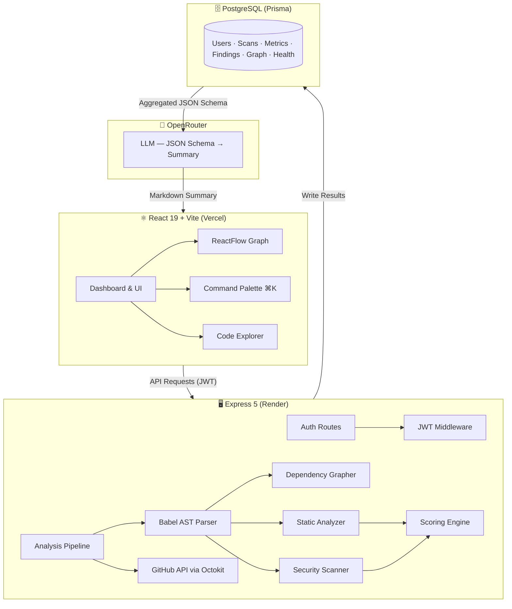

<div align="center">
  
</div>

<div align="center">
  <a href="https://github.com/adtshrm007">
    
  </a>
</div>

<br/>

<div align="center">
  <a href="https://github.com/adtshrm007">
    
  </a>
  &nbsp;
  <a href="https://github.com/adtshrm007?tab=followers">
    
  </a>
  &nbsp;
  <a href="https://github.com/adtshrm007">
    
  </a>
</div>

<br/>
<div align="center">
  
</div>
<br/>

---

## `$ whoami`

<table>
<tr>
<td width="52%" valign="top">

```typescript
const aditya: Developer = {
  role:     "Full Stack Architect",
  location: "🇮🇳 India",
  focus:    "RepoLens Platform",

  expertise: {
    frontend:  ["React 19", "Next.js", "Vite"],
    backend:   ["Node.js", "Express 5"],
    ai:        ["Gemini", "OpenRouter", "LLMs"],
    analysis:  ["Babel AST", "ReactFlow"],
  },

  currentlyBuilding: "RepoLens V2",
  learning:          "Scalable System Design",
  openTo:            ["Collaboration", "OSS"],
  status:            "Available 🟢",
};
```

</td>
<td width="48%" valign="top">

<br/>

| | |
|---|---|
| 🔭 **Current** | Building RepoLens |
| 🎓 **Learning** | Scalable Architectures |
| 💼 **Experience** | 2+ Years Production |
| 📈 **Growth** | Continuous Learner |
| 🤝 **Collaborate** | Always Open |
| 💡 **Passion** | AI + Code Intelligence |
| 🎯 **Goal** | Tech Leadership |
| ⚙️ **Mindset** | Systems Thinking |

<br/>

> *"Code is poetry written in logic — every line should tell a story of precision and elegance."*

</td>
</tr>
</table>

---

## 🎬 &nbsp;Featured Projects

<br/>

### 🔭 &nbsp;`PROJECT_01` — RepoLens V2 &nbsp;·&nbsp; *Full-Stack Code Intelligence Platform*

<table>
<tr>
<td width="56%" valign="top">

```
┌─────────────────────────────────────────────────────┐
│              ARCHITECTURE OVERVIEW                   │
├─────────────────────────────────────────────────────┤
│                                                      │
│  🔗  Dependency Graph Engine                        │
│  ├── Babel AST Parser    (Import Traversal)         │
│  └── ReactFlow DAG       (Interactive Graph)        │
│                                                      │
│  📊  Static Analysis Engine                         │
│  ├── Cognitive Complexity  (Deterministic)          │
│  └── LOC / Nesting / Fn Size                        │
│                                                      │
│  🛡️  Security Scanner                               │
│  ├── Lexical Pass        (Regex Secrets Scan)       │
│  └── Structural Pass     (AST eval() Detection)     │
│                                                      │
│  🏆  Scoring Engine                                 │
│  ├── Maintainability (35%)   Security (35%)         │
│  └── Architecture (20%)      Docs (10%)             │
│                                                      │
│  🤖  AI Presentation Layer   (OpenRouter)           │
│  ├── JSON Schema → LLM   (No Raw Code Sent)         │
│  └── ~98% Token Cost Reduction                      │
│                                                      │
└─────────────────────────────────────────────────────┘
```

</td>
<td width="44%" valign="top">

<br/>

```yaml
engines:
  dependency: "Babel AST + ReactFlow"
  static:     "Deterministic Metrics"
  security:   "Lexical + Structural"
  scoring:    "0-100 Health Score"

intelligence:
  engine:   "OpenRouter LLM"
  input:    "Compressed JSON Only"
  savings:  "~98% Token Cost"

auth:
  methods:  "JWT + GitHub + Google"
  sessions: "httpOnly Cookies"

features:
  explorer:  "Line-by-line AI"
  compare:   "Scan vs Scan"
  palette:   "⌘K Universal Search"
```

</td>
</tr>
</table>

**🌐 Live Demo:** [repo-lens-lovat.vercel.app](https://repo-lens-lovat.vercel.app/) &nbsp;|&nbsp; **📁 Source:** [github.com/adtshrm007](https://github.com/adtshrm007)

**Stack:**


<details>
<summary>🧬 &nbsp;<b>Request Lifecycle — Mermaid Diagram</b></summary>

<br/>



</details>

---

<br/>

### 🧠 &nbsp;`PROJECT_02` — Requesta &nbsp;·&nbsp; *AI Decision Intelligence Platform*

<table>
<tr>
<td width="56%" valign="top">

```
┌─────────────────────────────────────────────────────┐
│              ARCHITECTURE OVERVIEW                   │
├─────────────────────────────────────────────────────┤
│                                                      │
│  🎨  Frontend Layer                                 │
│  ├── React 18 + Vite       (Lightning Fast)         │
│  ├── Tailwind CSS          (Responsive Design)      │
│  ├── GSAP                  (Smooth Animations)      │
│  └── Framer Motion         (Advanced Effects)       │
│                                                      │
│  🧠  AI Backend Layer                               │
│  ├── Node.js + Express     (Core Server)            │
│  ├── MongoDB               (Data Persistence)       │
│  │   └── Aggregation Pipelines                      │
│  ├── Gemini AI API         (Intelligence Engine)    │
│  └── Redis                 (Caching Layer)          │
│                                                      │
│  🔐  Security & Access                              │
│  ├── JWT Authentication                             │
│  ├── RBAC (Role-Based Access Control)               │
│  ├── AES-256 Encryption                             │
│  └── Rate Limiting & DDoS Protection                │
│                                                      │
│  📊  Analytics & Monitoring                         │
│  ├── Real-time Dashboard                            │
│  ├── Performance Metrics                            │
│  └── System Health Monitoring                       │
│                                                      │
└─────────────────────────────────────────────────────┘
```

</td>
<td width="44%" valign="top">

<br/>

```yaml
performance:
  response_time: "< 100ms"
  uptime:        "99.9%"
  caching:       "Redis Layer"

intelligence:
  engine:   "Gemini AI API"
  routing:  "AI-powered"
  insights: "Real-time"

security:
  auth:       "JWT + RBAC"
  encryption: "AES-256"
  protection: "DDoS Shield"

observability:
  dashboard:  "Live"
  tracking:   "Behavioral"
  monitoring: "System Health"
```

</td>
</tr>
</table>

**Stack:**


---

<br/>

### 🎨 &nbsp;`PROJECT_03` — VS Code Theme Extension &nbsp;·&nbsp; *Developer Experience*

<table>
<tr>
<td width="56%" valign="top">

```
┌────────────────────────────────────────┐
│         CUSTOM VS CODE THEME           │
├────────────────────────────────────────┤
│                                        │
│  🎯  Design Philosophy                │
│  ├── Eye-friendly Color Palette       │
│  ├── WCAG AA+ Contrast Ratios         │
│  ├── Minimal Distraction              │
│  └── Syntax Optimization              │
│                                        │
│  ⚙️  Features                          │
│  ├── Multi-Language Support           │
│  ├── Custom Token Colors              │
│  ├── Terminal Theme                   │
│  └── Full UI Customization            │
│                                        │
│  📦  Distribution                     │
│  └── VS Code Marketplace              │
│                                        │
└────────────────────────────────────────┘
```

</td>
<td width="44%" valign="top">

<br/>

```yaml
distribution:
  platform: "VS Code Marketplace"
  support:  "Multi-language"

design:
  contrast: "WCAG AA+"
  palette:  "Eye-friendly"
  focus:    "Syntax clarity"

customization:
  tokens:   "Custom colors"
  terminal: "Themed"
  ui:       "Full coverage"
```

</td>
</tr>
</table>

**Tech:** &nbsp;`JavaScript` &nbsp;·&nbsp; `VS Code Extension API` &nbsp;·&nbsp; `JSON Configuration`

---

<br/>

## 💻 &nbsp;Tech Arsenal

<div align="center">

### 🎨 &nbsp;Frontend


### 🔧 &nbsp;Backend & APIs


### 🗄️ &nbsp;Data & Storage


### 🤖 &nbsp;AI & ML


### 🚀 &nbsp;Cloud & DevOps


### 🛠️ &nbsp;Tools


</div>

---

<br/>

## 📊 &nbsp;GitHub Analytics

<div align="center">
  
  &nbsp;&nbsp;
  
</div>

<br/>

<div align="center">
  
</div>

---

<br/>

## 📈 &nbsp;Contribution Activity

<div align="center">
  
</div>

---

<br/>

## 🐍 &nbsp;Contribution Snake

<div align="center">

> ⚙️ **One-time setup required:** Add the [Platane/snk](https://github.com/Platane/snk) GitHub Action to your profile repository, then go to **Settings → Actions → General → Workflow permissions** and select **Read and write permissions**. The snake SVG will auto-generate on the next workflow run.

<!--
  After the workflow runs successfully, uncomment this line:
  
-->

</div>

---

<br/>

## 🏆 &nbsp;Achievements

<div align="center">
  
</div>

---

<br/>

## 📊 &nbsp;Skill Proficiency Matrix

```
┌──────────────────────────────────────────────────────────────┐
│              TECHNICAL COMPETENCY ASSESSMENT                  │
├──────────────────────────────────────────────────────────────┤
│  🎯  Full Stack Development             95%   ⭐⭐⭐⭐⭐        │
│  ████████████████████████████████████░░░░░                   │
│                                                               │
│  🔬  Static Analysis & AST Tooling      91%   ⭐⭐⭐⭐⭐        │
│  ██████████████████████████████████░░░░░░░                   │
│                                                               │
│  🎨  Frontend Design & UX               90%   ⭐⭐⭐⭐⭐        │
│  ██████████████████████████████████░░░░░░░                   │
│                                                               │
│  📊  Database Design & Optimization     88%   ⭐⭐⭐⭐⭐        │
│  █████████████████████████████████░░░░░░░░                   │
│                                                               │
│  🏗️  System Design & Architecture       82%   ⭐⭐⭐⭐          │
│  █████████████████████████████████░░░░░░░░                   │
│                                                               │
│  ☁️  Cloud & Infrastructure              80%   ⭐⭐⭐⭐          │
│  ████████████████████████████████░░░░░░░░░                   │
│                                                               │
│  🧠  AI/ML Integration & LLMs           78%   ⭐⭐⭐⭐          │
│  ████████████████████████████████░░░░░░░░░                   │
│                                                               │
│  🔐  Security & Authentication          76%   ⭐⭐⭐⭐          │
│  ███████████████████████████████░░░░░░░░░░                   │
├──────────────────────────────────────────────────────────────┤
│  Legend:  ██ Expertise   ░░ Active Learning                   │
└──────────────────────────────────────────────────────────────┘
```

---

<br/>

## 🎯 &nbsp;Currently Working On

<table>
<tr>
<td width="33%" valign="top">

### 🔭 &nbsp;RepoLens V2
```yaml
focus:
  - Multi-language AST
  - Deeper security passes
  - Scan comparison UX

status: "Active Dev 🟢"
priority: HIGH
```

</td>
<td width="33%" valign="top">

### 📚 &nbsp;System Design
```yaml
focus:
  - Scalable architectures
  - Microservices patterns
  - DB optimization

status: "In Progress 🟡"
priority: MEDIUM
```

</td>
<td width="33%" valign="top">

### 🤖 &nbsp;AI Integration
```yaml
focus:
  - LLM applications
  - Prompt engineering
  - Retrieval systems

status: "Exploring 🟡"
priority: MEDIUM
```

</td>
</tr>
</table>

---

<br/>

## 🤝 &nbsp;Let's Connect

<div align="center">

[](https://github.com/adtshrm007)
[](https://www.linkedin.com/in/aditya-sharma-836856315/)
[](https://twitter.com/adtshrm007)
[](mailto:adtshrm277@gmail.com)
[](https://leetcode.com/adtshrm007/)

<br/>

| Area | Focus |
|------|-------|
| ✨ **Building** | Next-generation web applications |
| 🔬 **Analyzing** | Code health, security & architecture at scale |
| 🤖 **Integrating** | AI into real-world solutions |
| 🚀 **Scaling** | Systems that impact millions |
| 📖 **Contributing** | Open-source communities |
| 👥 **Mentoring** | Aspiring developers |
| 💡 **Discussing** | System design & architecture |

</div>

---

<br/>

## 💎 &nbsp;Developer DNA

```typescript
╔════════════════════════════════════════════════════════╗
║                  FUN FACTS ABOUT ME                     ║
╠════════════════════════════════════════════════════════╣
║                                                         ║
║  🧩  Debugging == Puzzle Solving Superpower            ║
║      Every bug is just a feature in disguise           ║
║                                                         ║
║  🌳  I read ASTs like others read maps                 ║
║      Import graphs are my kind of scenery              ║
║                                                         ║
║  🎮  Gaming sharpens problem-solving instincts         ║
║      Thinking differently outside of code              ║
║                                                         ║
║  📚  Reading > Sleeping                                ║
║      Tech blogs at 3 AM is my thing                   ║
║                                                         ║
║  ☕  Code quality ∝ Coffee consumption                 ║
║      Correlation not proven, but strongly suspected    ║
║                                                         ║
║  🎵  Lo-fi beats + Code == Ultimate Productivity       ║
║      Scientifically proven by me, repeatedly           ║
║                                                         ║
╚════════════════════════════════════════════════════════╝
```

---

<br/>

## 🌟 &nbsp;Mantra

<div align="center">

> *"Code is poetry written in logic — every line should tell a story of precision and elegance."*

> *"Scalability isn't just about servers — it's about thinking bigger every single day."*

> *"The best developers solve the hardest problems with the simplest solutions."*

<br/>

### 🎁 &nbsp;If my work inspires you, a ⭐ on my repositories means the world!

</div>

---

<div align="center">

```
  ╔══════════════════════════════════════════════════════════════╗
  ║    Made with ❤️  by Aditya Sharma                           ║
  ║    Building the Future, One Commit at a Time  🚀            ║
  ║                                                              ║
  ║    Let's build something amazing together.                   ║
  ╚══════════════════════════════════════════════════════════════╝
```

<br/>


</div>
